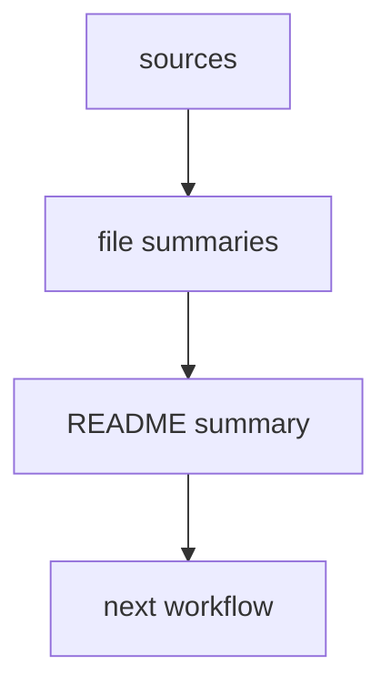

# Packet Summary

Created: {{created_date}}
Updated: {{updated_date}}
Version: 0.1

## Scope

{{packet_scope}}

## Key Findings

- {{finding}}

## File Notes

### `sources/{{file_name}}`

- Type: {{type}}
- Source date: {{source_date_or_unknown}}
- Why it matters: {{why_it_matters}}
- Reusable points:
  - {{reusable_point}}
- Caveats:
  - {{caveat}}

## Source-To-Output Map

## Change Log

- {{created_date}} v0.1: created packet summary.
